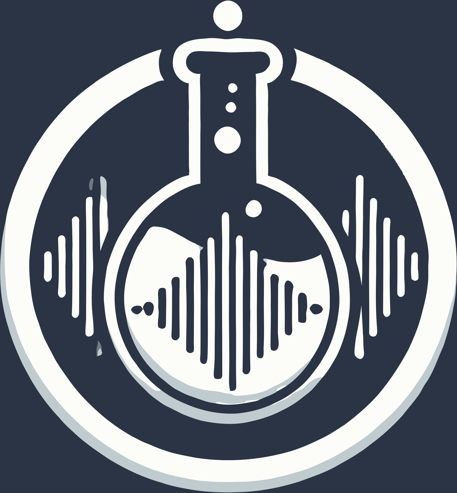

# AudioLab



[](LICENSE)
[](https://www.python.org/downloads/)
[](https://developer.nvidia.com/cuda-downloads)
[](CONTRIBUTING.md)

#### Thanks to RunDiffusion for supporting this application!!! ####

AudioLab is an open-source powerhouse designed to bridge the gap in voice-cloning and audio separation technologies. Built with modularity and extensibility in mind, it serves as your go-to solution for advanced audio processing needs. Whether you're an audio engineer, researcher, or hobbyist, AudioLab has something for you.

---

## 🌟 Features

### Audio Processing Capabilities
- **Music Generation:** Create music from scratch or remix existing tracks using the brand-new YuE model(s).
- **Text-to-Speech:** Convert text into natural-sounding speech, clone voices, and more using Coqui TTS.
- **Audio Separation:** Isolate vocals, drums, bass, and other components from an audio track.
- **Vocal Isolation:** Differentiate lead vocals from background vocals.
- **Noise Removal:** Eliminate reverb, echo, crowd noise, and other unwanted sounds.
- **Voice Cloning:** Generate a high-quality voice model from just 30-60 minutes of data.
- **Audio Super Resolution:** Enhance the quality of your audio before processing or cloning.
- **Remastering:** Apply spectral characteristics from a reference track for professional-grade output.
- **Audio Conversion:** Seamlessly convert between popular formats.
- **Transcription:** Transform spoken audio into accurate text.
- **Spectral Comparison:** Analyze and compare the spectral features of two audio files.

### Automation Features
- Automatically preprocess audio for voice model training.
- Merge separated audio sources back into a single file with ease.

---

## 🛠️ Pre-requisites

To get started, ensure you have the following:
1. **Python 3.10**: We use advanced Python features like `match` statements. It has to be 3.10 for match, 3.11 won't work because fairseq is stupid.
2. **CUDA 12.4**: Other versions might work but are untested. Install the appropriate drivers for your system. Windows users MUST be using
CU124. Pre-compiled wheels are only available for this version.
3. **Virtual Environment:** Highly recommended to keep dependencies isolated.

> **Note:** This project assumes familiarity with basic Python setups. If you're new, there are countless tutorials to guide you—this is your chance to shine!

---

## 🚀 Installation

**Important:**
The `requirements.txt` file is intentionally incomplete. Use the provided `setup.bat` or `setup.sh` scripts to install dependencies in the correct order. These scripts have been tested with CUDA 12.1.

### Steps:
1. Clone the repository.
    ```bash
    git clone https://github.com/yourusername/audiolab.git
    cd audiolab
    ```
2. Set up a virtual environment and activate it:
    ```bash
    python -m venv venv
    source venv/bin/activate  # On Windows: venv\Scripts\activate
    ```
3. Run the setup script:
    ```bash
    ./setup.sh  # On Windows: setup.bat
    ```
4. Troubleshooting (Windows):
    - Downgrade `pip` if you encounter issues:
        ```bash
        python -m pip install pip==24.0
        ```
    - Install older CUDA drivers if necessary: [Download Here](https://developer.nvidia.com/cuda-toolkit-archive).
    - Manually install `fairseq` if needed:
        ```bash
        pip install fairseq>=0.12.2 --no-deps
        ```

---

## 🎛️ Running AudioLab

1. Activate your virtual environment:
    ```bash
    source venv/bin/activate  # On Windows: venv\Scripts\activate.bat or venv\Scripts\Activate.ps1
    ```
2. Run the application:
    ```bash
    python main.py
    ```
3. Optional flags:
    - `--listen`: Bind to `0.0.0.0` for remote access.
    - `--port PORT`: Specify a custom port.

---

## 🤝 Acknowledgements

AudioLab stands on the shoulders of giants. Here are the amazing open-source projects integrated into its ecosystem:
- [python-audio-separator](https://github.com/nomadkaraoke/python-audio-separator) - Core for audio separation.
- [matchering](https://github.com/sergree/matchering) - For professional-grade audio remastering.
- [versatile-audio-super-resolution](https://github.com/haoheliu/versatile_audio_super_resolution) - For enhancing audio quality.
- [Real-Time-Voice-Cloning](https://github.com/RVC-Project/Retrieval-based-Voice-Conversion-WebUI) - Voice cloning capabilities.
- [MVSEP-MDX23](https://github.com/ZFTurbo/MVSEP-MDX23-music-separation-model) - Advanced music separation.
- [WhisperX](https://github.com/m-bain/whisperX) - Accurate audio transcription.
- [Coqui TTS](https://github.com/coqui-ai/TTS) - For state-of-the-art text-to-speech.
- [YuE](https://github.com/multimodal-art-projection/YuE) - For music generation.

---

## 🌟 Contribute

We welcome contributions! Check out the [Contributing Guide](CONTRIBUTING.md) for more details.

---

## 📜 License

This project is licensed under the MIT License. See the [LICENSE](LICENSE) file for details.
Various submodules may have their own licenses.

---

Made with ❤️ by the AudioLab team.
